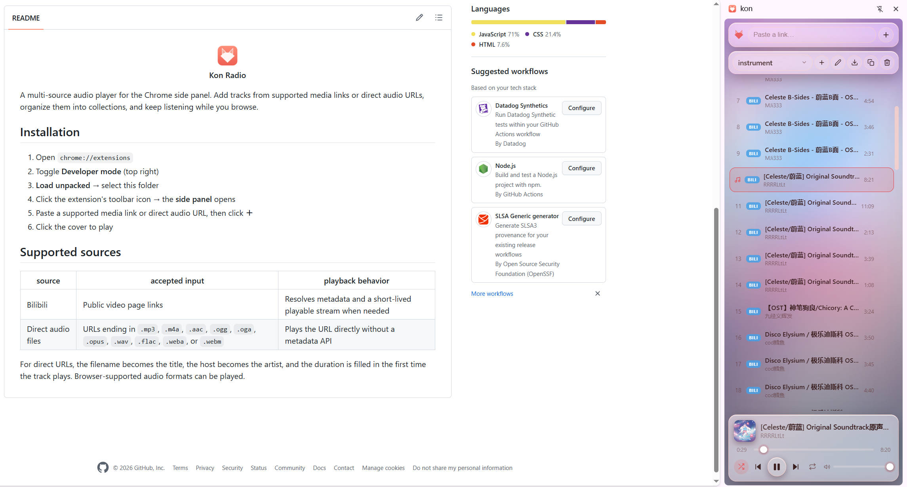

    <picture>
    
    </picture>
     
    <b>Kon Radio</b>

A multi-source audio player for the Chrome side panel. Add tracks from supported
media links or direct audio URLs, organize them into collections, and keep listening
while you browse.

## Installation

1. Open `chrome://extensions`
2. Toggle **Developer mode** (top right)
3. **Load unpacked** → select this folder
4. Click the extension's toolbar icon → the **side panel** opens
5. Paste a supported media link or direct audio URL, then click **＋**
6. Click the cover to play
7. Use the ⭳ button right of the volume slider to save the playing track as an audio file

## Supported sources

| source | accepted input | playback behavior |
|--------|----------------|-------------------|
| Bilibili | Public video page links | Resolves metadata and a short-lived playable stream when needed |
| Direct audio files | URLs ending in `.mp3`, `.m4a`, `.aac`, `.ogg`, `.oga`, `.opus`, `.wav`, `.flac`, `.weba`, or `.webm` | Plays the URL directly without a metadata API |

For direct URLs, the filename becomes the title, the host becomes the artist, and
the duration is filled in the first time the track plays. Browser-supported audio
formats can be played.